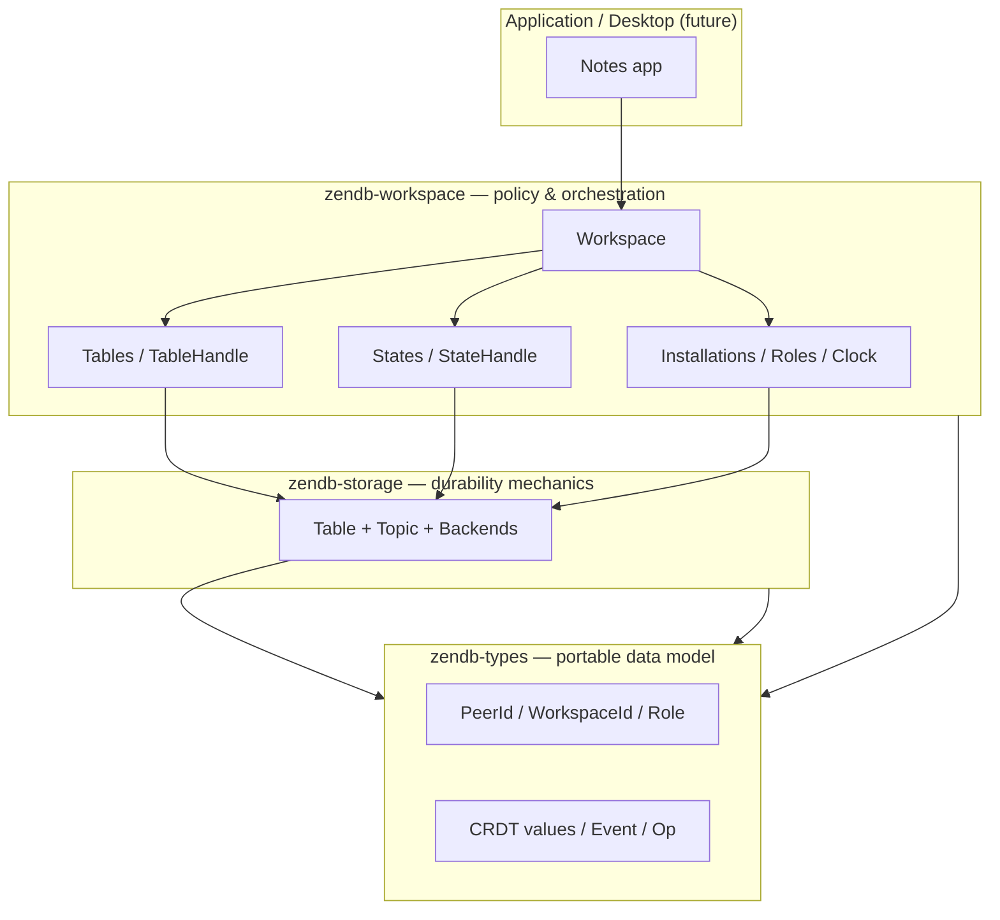
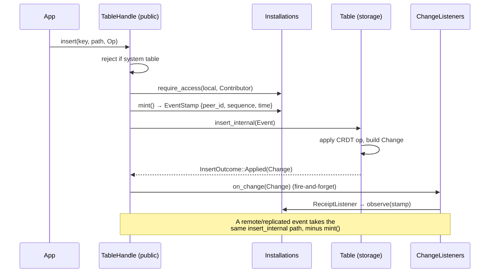
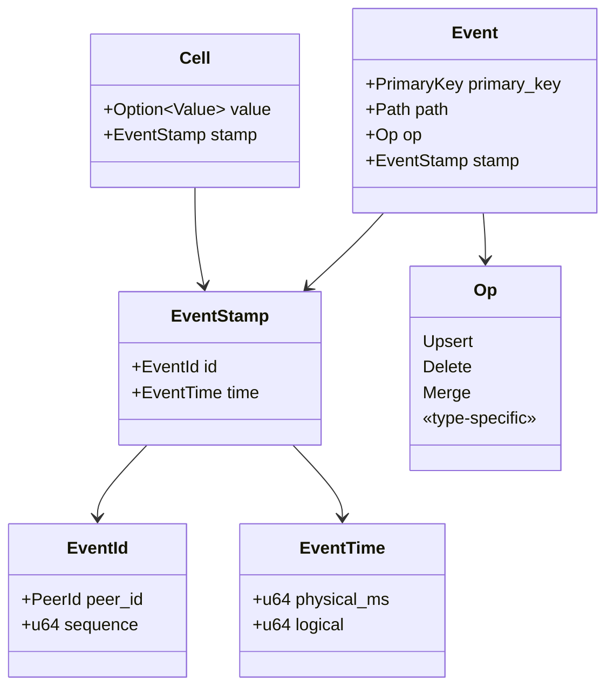
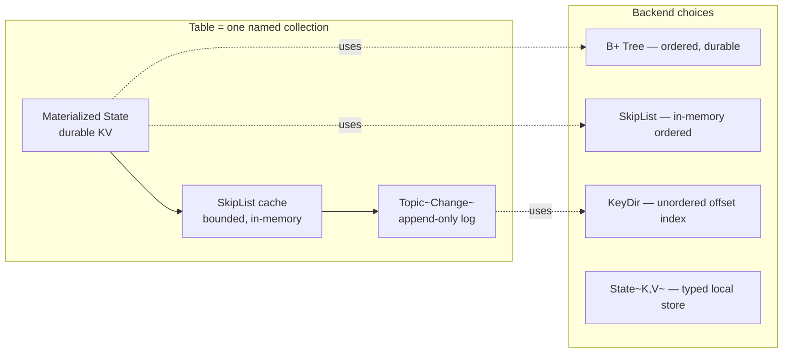
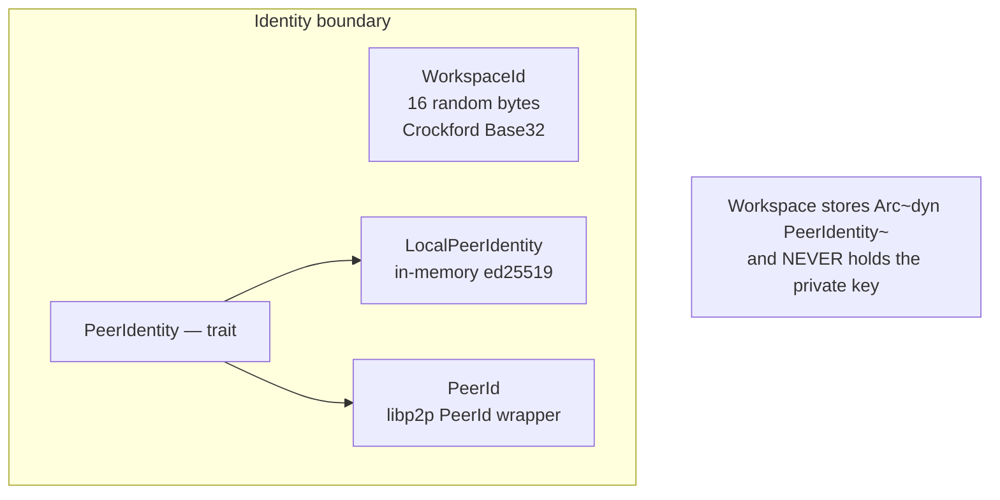
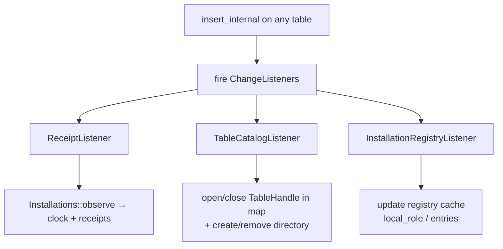

# ZenDB — Current Architecture Baseline (AS-IS)

> **Decision record for ZNIN-14.** This is the accepted *as-built* technical
> baseline for the ZenDB MVP. It consolidates the latest `.plan/` decisions
> (iterations 0001–0005) and the current source, and lists the gaps that must
> be settled before application integration, replication, and operators.
> Where historical plan iterations conflict, the latest accepted decision
> wins (iteration 0005 supersedes 0003/0006/0007; iteration 0004 supersedes
> earlier catalog models).

---

## 1. What ZenDB is, in plain terms

ZenDB is a **small, synchronous, embedded database foundation** written in Rust.
Think of it as the storage engine underneath a future notes/desktop
application: it runs *inside* your process, writes to ordinary files on disk,
and needs no server.

The defining idea is that **every change is an event**. When you insert or
delete a value, ZenDB does not silently overwrite old data. Instead it stamps
the change with *who* made it (a installation identity), *when* (a hybrid clock), and
*where* in the data model. Those stamped events are appended to a durable log.
Because every change carries its own identity and timestamp, the same database
can later be **merged across installations** without losing information — that is the
property we will build replication on top of, but replication itself is not
part of this baseline.

This baseline documents the system **exactly as it is built today**: three Rust
crates with strict boundaries, a synchronous API, and no networking. It is the
contract that the MVP (local desktop notes) and the later LAN-sync work must
not break without a new decision.

> **At a glance**
>
> | | |
> |---|---|
| **Language** | Rust (edition 2024), fully synchronous |
> | **Shape** | Embedded library, no server, no async runtime |
> | **Core unit** | A stamped `Event` appended to a durable log |
> | **Crates** | `zendb-types` → `zendb-storage` → `zendb-workspace` |
> | **On disk** | Plain files under a workspace directory |
> | **Networking** | None (deferred to the replication decision) |
> | **Maturity** | Pre-MVP foundation; format is **not** migration-stable |

---

## 2. The big picture: three layers, one direction

ZenDB is organized as three crates that depend on each other in a single
direction. Lower crates know nothing about the higher ones — `zendb-storage`
has no idea what a "installation" or a "role" is, and `zendb-types` does no file I/O
at all. This keeps each layer testable and keeps policy (who is allowed to
write) separate from mechanics (how bytes hit disk).



> **Boundary rule (enforced by the codebase)**
> Dependencies flow only downward: `types ← storage ← workspace`. No crate
> pulls in an async runtime. The workspace crate is the *only* place where
> authorization, installations, and clocks exist.

---

## 3. How a write actually happens

Before diving into types, it helps to follow one write end-to-end. This is the
path every local mutation takes, and it is also the exact seam where future
replication will land.



Two things to notice, because they matter for the future:

1. **Minting and applying are separate.** `mint()` assigns the stamp;
   `insert()` applies it. A *replicated* event already has a stamp, so it skips
   `mint()` and goes straight to `insert_internal`. That convergence point is
   the replication seam.
2. **Listeners are fire-and-forget.** They return `()` and run synchronously
   after the write. If a listener fails, the write already succeeded — see the
   gaps section.

---

## 4. The event and CRDT model

This is the heart of the system. Everything else is plumbing around it.

### 4.1 Anatomy of an event



- **`EventId`** = *which installation* (`PeerId`) and *which number* (`sequence`,
  per installation). Together they make an event globally identifiable.
- **`EventTime`** is a **hybrid logical clock**: wall-clock milliseconds plus a
  `logical` counter that breaks ties when two events share the same millisecond.
  This gives a consistent total order across installations without requiring
  perfectly synchronized clocks.
- **`Op`** is the mutation: `Upsert` (create/replace), `Delete`, `Merge`, and
  type-specific operations.
- A **`Cell`** is what lives at a key: an optional CRDT `Value` plus the stamp
  of the event that produced it.

### 4.2 CRDT values

"CRDT" means *conflict-free replicated data type*: when two installations change the
same key, the values can be merged deterministically without a central arbiter.
ZenDB registers a fixed set of these:

| Kind | Types |
|---|---|
| **Keys** | `PeerId`, `Bool`, `Int`, `String`, `Timestamp`, `Blob` |
| **Leaf values** | `Bool`, `Int`, `String`, `Timestamp`, `Blob`, `Float32`, `Float64`, `Counter`, `MvRegister`, `OrSet`, `PriorityQueue`, `Set`, `Text` |
| **Containers** | `Record` (nested segments), `List` |

> **Why this matters for replication**
> Because values are CRDTs and every event is stamped, two replicas that have
> seen the same set of events will converge to the same state. The baseline
> *stores and merges* these today; it does not yet *exchange* them over a
> network.

---

## 5. The storage engine (`zendb-storage`)

This crate is pure mechanics: how a table is represented in memory and on disk.
It has no notion of installations, roles, or networking.



Key facts:

- A **`Table`** is a fixed `PrimaryKey → Cell` shape, backed by a materialized
  `State`, a bounded in-memory `SkipList` cache, and a durable
  `Topic<Change>`. Its **only** mutation entry point is
  `Table::insert(Event) → InsertOutcome` (`Applied(Change)` or `Ignored`).
- The **`Topic<Change>`** is a segmented append-only log. It supports named
  **`TopicConsumer`** cursors that can `commit`, `seek`, and `reset`. This is
  the natural per-table write-ahead log and the future primitive for
  anti-entropy replay ("send me everything after offset N").
- Backends are deliberately simple: a magic-byte check on open, **no
  checksums, no per-insert validation** — by design, per the project rules.

---

## 6. Identity, installations, and roles (`zendb-workspace`)

This is the policy layer. It decides *who* a installation is and *what* it may do.

### 6.1 Identities



- **`WorkspaceId`** identifies one workspace directory. It is *not* a network
  peer and does *not* use the libp2p representation.
- **`PeerId`** is a thin wrapper around `libp2p_identity::PeerId` (ed25519).
  This is why the project already "borrowed" the libp2p `PeerId` — it is the
  native type, not just the name.
- **`PeerIdentity`** is a trait: `peer_id()`, `display_name()`, `sign()`. The
  workspace uses it to mint stamps and (later) sign events, but it **never sees
  the private key**. An application can back it with an OS keychain, HSM, or
  KMS without changing the workspace.

### 6.2 Roles and authorization

Roles form a strict hierarchy:


| Operation | Reader | Contributor | Operator | Admin |
|---|---|---|---|---|
| Read tables | ✅ | ✅ | ✅ | ✅ |
| Write application tables | ❌ | ✅ | ✅ | ✅ |
| Write application states | ✅ | ✅ | ✅ | ✅ |
| Create/update/delete table declarations | ❌ | ❌ | ❌ | ✅ |
| Add/update installation records & roles | ❌ | ❌ | ❌ | ✅ |
| Future dispatch operations | ❌ | ❌ | ✅ | ✅ |

Authorization is checked **twice** on the local path: once before minting (so a
denied write does not consume a sequence number) and once inside
`insert_internal` (the final guard, and the path a replicated event also hits).

### 6.3 Installations and the clock

`Installations` owns:

- the installation registry (`_installations` table),
- the local hybrid clock (`mint` advances `sequence` + `EventTime` together),
- **receipt windows** (`observe` tracks which sequences from each peer have
  been seen — the duplicate-detection and causal-cursor mechanism),
- an authorization cache and a separate write-back peer cache.

A `Installation` is simply `{ display_name, role }`. The `display_name` is
seeded from `PeerIdentity::display_name()` when a workspace is created and is
later changed only through an explicit `upsert`.

---

## 7. Workspace lifecycle and on-disk layout

A **`Workspace`** is created, opened, or joined. `join` persists a
caller-supplied `WorkspaceId` and a (currently empty) `JoinHints` placeholder;
it does not yet contact any network. `Bootstrap` owns the lock file and the
identity file so only one process opens a workspace at a time.

On disk, a workspace is just files:

```text
workspace-root/
  _identity          ← WorkspaceId (write once)
  _lock              ← advisory OS file lock
  tables/
    _catalog/        ← table name → TableConfig (source of truth)
    _installations/        ← PeerId   → Installation
    <table-name>/
  states/
    _catalog/        ← state name → StateConfig
    _peers/          ← PeerId   → PeerState (clock + receipts)
    <state-name>/
```

The `_catalog` and `_installations` tables are self-registering: they are written
through the normal authorized insert path during bootstrap, and their
in-memory handle maps are then maintained *only* by listeners (see below).

---

## 8. The listener model (where side effects live)

ZenDB avoids a central dispatcher. Instead, each `TableHandle` carries a list
of `ChangeListener`s that fire synchronously after every `insert_internal`.
There are three internal listeners, each the *single owner* of one side effect:



| Listener | Owns | File |
|---|---|---|
| `ReceiptListener` | feeding `Installations::observe` (clock + receipts) | `tables/listeners/receipts.rs` |
| `TableCatalogListener` | the in-memory table-handle map after bootstrap (open on `Upsert`, close + `rmdir` on `Delete`) | `tables/listeners/catalog.rs` |
| `InstallationRegistryListener` | the in-memory installation-record cache after initial load | `tables/listeners/installations.rs` |

> **Why this matters**
> Because listeners converge on `insert_internal`, a *replicated* event that
> reaches `insert_internal` will automatically update receipts, the catalog
> map, and the installation cache — no separate code path needed. The listener model
> *is* the replication convergence design.

---

## 9. Durability and failure semantics

- `Workspace`, `Installations`, `Tables`, and `States` all expose `flush()` (write
  back + OS flush) and `sync()` (write back + durable sync).
- `Workspace` and `Installations` also flush from their `Drop` impl as a best-effort
  safety net. **Drop-time errors are intentionally ignored** — callers that
  need a guarantee must call `sync()` explicitly.
- Validation is minimal by design: backends do a magic-byte check and nothing
  more. There are no checksums and no per-insert validation. The assumption is
  that the application configuring the database knows what it is doing.

---

## 10. Known gaps (must be settled before MVP blockers)

These are explicit, not hidden. Most are already tracked as linked issues.

| Gap | Why it matters | Linked issue |
|---|---|---|
| **Listener failures are invisible** | `on_change` returns `()`; a failing listener leaves in-memory state stale but rebuildable on restart. No retry, no surfacing. | ZNIN-20 |
| **Configuration transitions undefined** | `upsert` no-ops when a `TableConfig` changes; migration on config change is unspecified. | ZNIN-21 |
| **Concurrency claims unaudited** | `mint`/`observe` lock the peer cache; `insert_internal` locks the `Table`. Cross-thread re-entrancy for a background replicator is not yet proven. | ZNIN-22 |
| **Replication admission** | `EventStamp.peer_id` is a *claim*, not authenticated. `insert_internal` checks role but not signature/identity. A replicated event is trusted by role alone today. | ZNIN-36 + iter-0005 §3.5 |
| **Placeholder join** | `JoinHints` is empty; `Workspace::join` persists the id but contacts no network. | deferred to replication |
| **Crash-recovery guarantees** | `flush`/`sync`/`Drop` semantics are coded but not formally verified against power-loss. | ZNIN-22 |
| **Event signing not attached** | `PeerIdentity::sign` and `Signature` exist and are `Encode`/`Decode`, but no event envelope carries a signature yet. | pre-replication |

> **⚠️ The single most important gap for the MVP blockers**
> Today, any caller that reaches `insert_internal` is trusted by *role alone*.
> There is no signature verification. The LAN-sync decision (ZNIN-36) and the
> event-signing work must land before any remote event is admitted, or a peer
> could forge another peer's identity. This is the line item to settle first.

---

## 11. Explicitly out of scope (non-goals of this baseline)

- No transport, replication runtime, snapshot protocol, or operator host.
- No public `Workspace::apply_event` entry point (the seam is `insert_internal`).
- No peer discovery, multiaddr handling, or populated connection hints.
- No on-disk migration compatibility — breaking format changes are acceptable
  at this stage.

---

## 12. Appendix — public API surface (reference)

### `zendb-types`
`PeerId`, `WorkspaceId`, `PeerIdentity`, `Role`, `Signature`, `SigningError`,
`IdParseError`, `WorkspaceIdParseError`; the full CRDT `Value`/`Type`/`Op`
machinery via `register_types!`.

### `zendb-storage`
`Table`, `Change`, `InsertOutcome`, `TableConfig`, `TableStats`,
`DEFAULT_MAX_BUFFERED_RECORDS`; `Topic`, `TopicConfig`, `TopicConsumer`,
`TopicOffset`, `TopicStats`; `BPlusTree`, `SkipList`, `KeyDir`, `State`,
`StateConfig`, `Storage`, `DurableStorage`, `ReadBackend`, `WriteBackend`,
`OrderedReadBackend`.

### `zendb-workspace`
`Workspace` (`create` / `open` / `join` / `flush` / `sync` / `id` / `root` /
`peer_identity` / `installations` / `tables` / `states`), `WorkspaceConfig`,
`JoinHints`; `Tables` (`contains` / `list` / `upsert` / `get` / `delete` /
`flush` / `sync`); `TableHandle` (`insert` / `read` / `consumer` /
`add_listener` / `is_system`); `ChangeListener`; `States` (`upsert` / `get` /
`list` / `list_open` / `close` / `flush` / `sync`); `StateHandle`; `Installations`
(`list` / `get` / `upsert` / `has_access` / `local_peer_id` / `flush` /
`sync`); `Installation`; `Error` / `Result`.

---

*Baseline generated from source at iterations 0001–0005. Conflicts resolved in
favor of the latest accepted iteration. Linked from ZNIN-14.*
