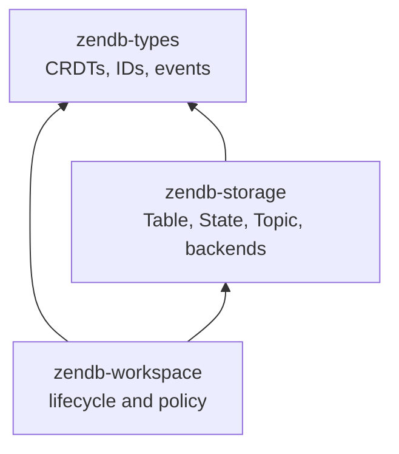

# Iteration 0001: Current Table and Installation Architecture

Status: as-built documentation for the current repository

This document replaces the earlier architectural draft. It describes the code
that exists now, the decisions that constrained this iteration, and the
boundaries that are deliberately left for later work. It is not a proposal
for networking, replication, snapshots, operators, or an asynchronous runtime.

## 1. Current Scope

The Cargo workspace contains three crates:

| Crate | Current responsibility |
| --- | --- |
| `zendb-types` | Portable identifiers, event stamps, Cells, operations, paths, and CRDT value types |
| `zendb-storage` | B+ tree, KeyDir, SkipList, generic State, Topic, and the invariant-preserving Table facade |
| `zendb-workspace` | Workspace lifecycle, catalog, application Table handles, local typed State lifecycle, installation registry, local clock, and receipt tracking |

The removed crates and concepts are not part of the current workspace:

- engine;
- transport and networking;
- replication protocols and shared journals;
- snapshots and snapshot repair;
- operators, timers, executors, and Rhai;
- sync policy, publication branches, frontiers, signatures, and wire envelopes;
- the old testing and type-converter crates.

This is a synchronous embedded database foundation. Workspace is concrete glue
over storage and types; there is no service-trait or background-worker layer.

## 2. Dependency And Source Layout



The relevant source layout is:

```text
zendb-types/src/
  crdt/
    cell.rs event.rs op.rs path.rs stamp.rs _traits.rs values/
  identity/
    ids.rs

zendb-storage/src/
  backend/
    btree.rs keydir.rs skiplist.rs state.rs _traits.rs
  table/
    table.rs iter.rs change.rs
  topic.rs
  utils/

zendb-workspace/src/
  workspace.rs
  error.rs
  catalog/
    mod.rs model.rs names.rs runtime.rs states.rs
  installations/
    mod.rs clock.rs receipts.rs registry.rs
```

The smaller catalog and installation files are internal components. The public
workspace concepts remain the Workspace, Catalog-facing table and State
handles, and Installations.

## 3. Event And CRDT Model

### 3.1 Event identity and ordering

`zendb-types` separates identity from hybrid time:

```rust
pub struct EventId {
    pub installation_id: InstallationId,
    pub sequence: u64,
}

pub struct EventTime {
    pub physical_ms: u64,
    pub logical: u32,
}

pub struct EventStamp {
    pub id: EventId,
    pub time: EventTime,
}

pub struct Event {
    pub primary_key: PrimaryKey,
    pub path: Path,
    pub op: Op,
    pub stamp: EventStamp,
}
```

`EventStamp` has total ordering by:

```text
(physical_ms, logical, installation_id, sequence)
```

`EventId::ZERO`, `EventTime::ZERO`, and `EventStamp::ZERO` are sentinels.
Sequence zero is rejected by the receipt and local-clock paths. Constructors
themselves remain lightweight value constructors.

### 3.2 Cells and operations

A Cell is only a value plus its structural stamp:

```rust
pub struct Cell {
    pub value: Option<Value>,
    pub stamp: EventStamp,
}
```

`None` is a tombstone. `Op` currently supports type operations, deletion,
replacement, and Cell merge. There is no synchronization-policy metadata.

The CRDT contracts use the two-stamp context requested for this iteration:

```rust
pub struct MergeStamps {
    pub current: EventStamp,
    pub incoming: EventStamp,
}

trait Type {
    type Op;
    type Error;

    fn apply(&mut self, op: &Self::Op, stamps: MergeStamps) -> Result<bool, Self::Error>;
    fn merge(&mut self, incoming: &Self, stamps: MergeStamps) -> Result<bool, Self::Error>;
    fn max_stamp(&self) -> EventStamp;
}
```

`ContainerType::apply_walk` receives the same `MergeStamps`. As a path is
walked, the current stamp is rebuilt from the selected child while the
operation's incoming stamp is preserved. A successful operation returns
`true`; an older or otherwise ineffective operation returns `false`.

The old sync-policy and compaction-hook surfaces are gone. `CellProxy` remains
only where it is still useful for value conversion (for example byte arrays);
backend configuration types no longer use config-to-Cell proxy conversions.

### 3.3 Blob metadata encoding

`Blob` is an opaque byte value with generic bincode helpers:

```rust
Blob::encode<T: Encode>(&T) -> Result<Blob, BlobCodecError>
Blob::decode<T: Decode<()>>(&self) -> Result<T, BlobCodecError>
```

Decode requires complete input consumption and rejects trailing bytes. Catalog
and installation metadata use this mechanism instead of representing every config
field as separate Cells. There is no catalog Blob size limit.

## 4. Storage Contracts

`zendb-storage` retains the existing backend algorithms and their generic
traits:

- `Storage` exposes `stats()` and `config()`;
- `DurableStorage` exposes `create`, `open`, `compact`, `flush`, and `sync`;
- `ReadBackend` exposes borrowed `get`, `contains`, `keys`, `values`, `entries`,
  `size`, and `is_empty`;
- `WriteBackend` owns raw key/value mutation;
- `OrderedReadBackend` adds ranges, first/last, and reverse iteration.

`BPlusTree`, `KeyDir`, and `SkipList` remain policy-free. `State<K, V>` selects
one of them using `StateConfig::Ordered`, `Unordered`, or `InMemory` and
implements the common storage traits. State remains generic and local; it is
not an event stream and does not emit Table Changes.

All durable storages share the same implementation-level `flush` path with
their `Drop` implementation. Trait methods route through that shared flush
implementation only because both the trait and `Drop` need the same behavior.

## 5. Table In Storage

### 5.1 Shape and identity

`Table` is a fixed `PrimaryKey -> Cell` facade composed of:

```text
State<PrimaryKey, Cell>
SkipList<PrimaryKey, Cell>       pending write cache
Topic<Change>                    durable operation history
TopicConsumer<Change>            internal recovery consumer
```

The storage Table has no table name and no TableId. The workspace chooses the
physical path and catalog key before calling `DurableStorage::create` or
`DurableStorage::open`.

`TableConfig` contains the selected State configuration, cache capacity, and
Topic configuration. The Catalog is the persisted configuration authority.
The current Table implementation retains a config clone in memory so it can
report `Storage::config()` and use the cache capacity; it does not persist a
second catalog declaration and it has no identity of its own.

`max_buffered_records` is passed directly to the bounded SkipList cache. There
is no separate Table-level validation step.

### 5.2 Mutation path

The only Table mutation entry point is:

```rust
Table::insert(event: Event) -> io::Result<InsertOutcome>
```

The method:

1. reads the current row from cache first and then materialized State;
2. creates a tombstone Cell when the row does not exist;
3. calls `Cell::apply_walk` with the current row stamp and event stamp;
4. returns `InsertOutcome::Ignored` without appending a Change when the
   operation has no effect;
5. appends `Change { event, previous, current }` to the Topic;
6. writes the new Cell to the pending cache;
7. advances the recovery consumer to the record after the appended Change;
8. returns `InsertOutcome::Applied { offset }`.

`Change` is storage-owned and contains no redundant `changed` Boolean:

```rust
pub struct Change {
    pub event: Event,
    pub previous: Option<Cell>,
    pub current: Option<Cell>,
}
```

The current insert path emits `current: Some(Cell)`, including a tombstone
Cell for deletes. The optional shape is retained for recovery records that may
represent removal of a materialized key.

`Table` implements `ReadBackend` and `OrderedReadBackend` but deliberately does
not implement `WriteBackend`, so callers cannot bypass event application and
history recording.

### 5.3 Cache, recovery, and durability

The cache is drained into State when it reaches its configured capacity and
before sync/flush. Applied events are appended to the Topic before the cache
is updated. The recovery consumer replays durable Changes into State on open.

For a durable State, recovery advances and commits its consumer after State is
updated. For `State::InMemory`, recovery commits are skipped, so the topic
history remains replayable from its committed origin rather than pretending
that an in-memory materialization is durable.

`DurableStorage::sync` drains the cache, syncs State, commits recovery, and
syncs the Topic. `DurableStorage::flush` additionally uses each backend's
flush semantics. `Drop` invokes the shared Table flush implementation.

### 5.4 Read iteration

Reads do not first build a full merged map. For ordered State backends,
`MergedEntries` lazily merges the ordered State iterator and ordered cache
iterator with two `Peekable` cursors. Equal keys are consumed from both and the
cache value wins. Ascending, descending, forward-range, and reverse-range
views use the same merge primitive.

For unordered State, ordinary Table iteration streams State rows while
filtering keys shadowed by the cache, then chains the cache rows. Any temporary
materialization required by an underlying ordered fallback belongs to that
backend's `OrderedReadBackend` implementation, not to the Table merge itself.

The storage iterator is borrowed and lazy. `TableHandle::read()` exposes it
through `TableReadGuard`. `TableHandle::entries()` is intentionally the
explicit convenience method that collects an owned `Vec<(PrimaryKey, Cell)>`.

### 5.5 Consumers and Topic

`Table::consumer(name)` is the public change-observation API. Consumers are
named, pull-based, independently checkpointed, and recoverable. There is no
`Table::changes()` API and no callback injection into Table construction.

Topic is the simple segmented append-only implementation with one active
reader per consumer name, volatile and committed offsets, segment rotation,
compaction, and recovery of partial active records. `consumer.commit()` writes
the offset entry; it does not perform an extra explicit flush. The owning Topic
and its Drop path provide eventual durability.

## 6. Workspace Lifecycle

### 6.1 Format and lock

`Workspace` owns:

```text
root: PathBuf
format: WorkspaceFormat
catalog: Catalog
installations: Installations
_lock: WorkspaceLock
```

The root contains `_format` and `_lock`. The format manifest stores version,
workspace ID, and the catalog TableConfig. The current format version is `1`.
Opening another version fails with `UnsupportedFormat`; no implicit migration
is attempted. A process-wide filesystem lock prevents two open Workspaces from
mutating the same root.

### 6.2 Create

`Workspace::create` performs the following synchronously:

1. create the root and acquire `_lock`;
2. reject an existing format manifest;
3. write a new workspace ID and format manifest;
4. create local installation clock and receipt storage;
5. create the fixed `system/catalog` Table;
6. write the `_catalog` declaration as a normal catalog Table row;
7. create the `_installations` Table declaration and runtime;
8. replay catalog and Table receipt consumers;
9. bind Installations to `_installations` and local installation state;
10. write the initial local Installation with all three permissions.

### 6.3 Open

`Workspace::open` acquires the lock, reads and validates `_format`, opens the
local installation state and Catalog, reconciles catalog rows into live Table
runtimes, replays catalog and table receipt consumers, and binds Installations. It
does not start background maintenance.

### 6.4 Public Workspace API

The public methods are:

```text
create / open
id / root / installations
create_table / table / contains_table / list_tables
update_table / delete_table
state / contains_state / list_states / list_open_states
state_config / close_state / delete_state
```

Application names are validated before lookup or mutation. Names may not be
empty, path separators, control characters, platform-invalid punctuation,
trailing spaces/dots, `.`/`..`, or Windows reserved installation names. Application
names may not start with `_`; `_catalog` and `_installations` are reserved system
names.

## 7. Catalog And Table Runtime

### 7.1 Catalog Table

`_catalog` is itself a normal `Table` at `system/catalog`. Each row is keyed by
the table name and stores a Blob-encoded, versioned `CatalogEntry`:

```rust
pub struct CatalogEntry {
    pub format_version: u16,
    pub config: TableConfig,
}
```

Catalog owns an in-memory index containing decoded entries and live
`TableRuntime` values. On open it scans the catalog Table, rejects malformed
keys, non-Blob values, undecodable entries, and unknown entry versions, then
opens or creates the corresponding physical Table runtime.

The Catalog operations are:

```text
create_table, table, contains_table, list_tables,
update_table, delete_table
```

`list_tables` hides `_catalog` and `_installations`. A catalog update changes the
persisted declaration; an already-open Table is not reconfigured in place and
uses the new config on a later open. Deleting a table writes a tombstone to
`_catalog`, invalidates its loaded runtime, removes it from the in-memory
index, and leaves physical directory cleanup to future lifecycle work.

### 7.2 TableRuntime and handles

`TableRuntime` is the workspace-owned wrapper around a storage Table. It holds:

```text
name: String
table: Arc<RwLock<Table>>
receipt: TopicConsumer<Change>
live: AtomicBool
```

The runtime, not the storage Table, owns the table name and stale-handle state.
`TableHandle` combines a runtime with Installations. Its insert path delegates to
Installations for permission checks, stamp minting, storage insertion, durability,
and receipt recording.

`TableHandle::read()` returns a `TableReadGuard` that holds the read lock and
deref-coerces to `Table`. No application callback executes while a lock is
held. `get()` copies one Cell; `entries()` explicitly materializes an owned
snapshot. A deleted table makes existing handles return `StaleHandle` for
future operations.

## 8. Local Generic State Catalog

Local State is separate from the replicated-ready Table catalog. Its durable
declarations are stored in:

```text
_local/states/_catalog    KeyDir<String, StateConfig>
_local/states/data/<name> State<K, V>
```

`Workspace::state::<K, V>(name, Option<StateConfig>)` validates the name and:

- returns a typed handle to an already-open State after checking the erased
  runtime type;
- ignores a newly supplied config when that State is already open;
- for a closed declared State, uses the persisted StateConfig and rejects a
  conflicting requested config with `MigrationRequired`;
- for a new State, uses the requested config or the default, creates the State,
  and persists its declaration.

The in-memory registry stores erased `Arc<RwLock<State<...>>>` values and
returns weak `StateHandle<K, V>` values. `StateHandle::get()` upgrades the weak
reference or returns `StaleHandle`. Closing succeeds only when no caller still
owns a strong State reference. Deleting a busy State returns `ResourceBusy`,
otherwise removes its declaration and data directory.

State is not a Table: it has caller-provided generic key/value types, no Event,
no Installation permission check, no receipt index, and no Topic Change history.

## 9. Installations, Clock, And Receipts

### 9.1 Installation registry and permissions

`_installations` is a normal Table whose primary keys are `PrimaryKey::InstallationId` and
whose values are Blob-encoded `Installation` values:

```rust
pub struct Installation {
    pub name: String,
    pub permissions: BTreeSet<WorkspacePermission>,
}

enum WorkspacePermission {
    Write,
    ManageCatalog,
    ManageInstallations,
}
```

The first local installation receives all permissions. Installations reload and cache
records from `_installations`; the cache is not the durable source of truth. Upserts
require `ManageInstallations`. Catalog operations require `ManageCatalog`, and
application Table inserts require `Write`.

### 9.2 Local clock

The local installation checkpoint is persisted in `_local/installation/clock` as a KeyDir
entry containing:

```text
installation_id
next_sequence
last EventTime
```

Clock access is mutex-protected. A candidate local stamp uses current wall time:
wall-clock advancement resets logical time to zero; otherwise logical time is
incremented. Sequence and logical overflow return `ClockExhausted`.

`LocalInstallation::perform` serializes a provisional stamp around a caller-provided
write. `Mutation::Applied` and `Mutation::Ignored` both record the stamp in
the receipt index and persist the next sequence/checkpoint. `Mutation::NoOp`
returns without consuming or recording a stamp. An ambiguous I/O error poisons
the local installation with `ReconciliationRequired` until the Workspace is reopened.

Remote observation updates the hybrid time using the maximum of wall, local,
and remote physical times, records the remote receipt, and advances the local
sequence if the observed event belongs to this installation.

### 9.3 Receipt windows

Receipt data is persisted per installation in `_local/installation/receipts` as:

```rust
pub struct ReceiptWindow {
    pub max_seen: u64,
    pub missing: Vec<RangeInclusive<u64>>,
}
```

Missing ranges are sorted and disjoint. `observe` rejects sequence zero,
extends a high-water mark with a gap, fills a gap in place, or reports a
duplicate. Membership and gap lookup use binary search. Arithmetic at the
`u64` boundary is checked.

Applied Table Changes are replayed through each runtime's reserved receipt
consumer. The consumer observes the event stamp and commits its cursor. An
ignored operation has no Change record; the direct mutation path records its
receipt through `LocalInstallation::perform` instead. `Installations` exposes
`has_received`, `observe`, and `missing` for this local bookkeeping; it does
not expose a replication transport or remote-ingestion pipeline.

## 10. Mutation Flows

### Application Table insert

```text
TableHandle::insert
  -> validate runtime is live
  -> require local Write permission
  -> mint provisional EventStamp
  -> construct Event from key, path, and Op
  -> Table::insert(Event)
  -> Applied: sync Table; commit receipt and clock checkpoint
  -> Ignored: record receipt and clock checkpoint; no Change is appended
  -> replay the runtime receipt consumer
```

The low-level storage API accepts only a complete Event. Workspace is the
layer that mints local identity and time.

### Catalog and installation updates

Catalog and installation mutations use the same local clock and permission path.
Their payloads are Blob-encoded metadata stored in ordinary Tables. Catalog
updates trigger synchronous runtime/index reconciliation; installation updates
refresh the in-memory permission cache after the Table mutation.

### No-op operations

`Workspace::update_table` returns `UpdateOutcome::Unchanged` through
`Mutation::NoOp` when the requested config equals the catalog declaration.
Deleting a missing table likewise returns `false` without a mutation stamp.

## 11. Durable Layout

The current paths are:

```text
workspace-root/
  _format
  _lock
  _local/
    installation/
      clock/
      receipts/
    states/
      _catalog/
      data/<state-name>/
  system/
    catalog/
      state/
      topic/
  tables/
    _installations/
      state/
      topic/
    <table-name>/
      state/
      topic/
```

Validated application names are catalog keys, runtime names, and physical
directory components. Cleanup and safe reuse of a deleted Table directory are
not implemented in this iteration; deleting a Table invalidates handles and
removes the catalog entry, but physical cleanup remains a lifecycle follow-up.

## 12. Concurrency And Error Boundaries

The implementation uses explicit synchronous locks:

- workspace file lock for one open Workspace per root;
- mutex-protected local clock and receipt persistence;
- `RwLock<Table>` inside each TableRuntime;
- short-lived Catalog index and Installations record locks;
- `TableReadGuard` for borrowed read iteration.

No application callback is invoked under a Table or registry lock. Storage
backend methods retain `io::Result`. Workspace maps failures into its custom
`Error` type, including I/O, encoding, invalid names, permissions, stale or
busy resources, corrupt workspace/catalog/installation state, clock exhaustion,
reconciliation-required state, and closed-State migration conflicts.

## 13. Settled Decisions

The following decisions are part of the current architecture:

1. `Table::consumer` is the change-observation name; there is no
   `Table::changes` proxy.
2. `Change` has event, previous Cell, and current Cell only; a separate
   `changed` flag is meaningless because a Change exists only after a
   successful state change.
3. `_catalog` is a real Table. Its cells are opaque Blob values containing
   bincode-encoded `CatalogEntry` data.
4. Table identity is a validated string owned by Catalog/TableRuntime. Storage
   Table has no TableId, name, or identity validation.
5. `TableConfig` is the persisted catalog configuration name. There is no
   `PersistedTableConfig`/`RuntimeTableConfig` split in the current API.
6. Local generic State declarations use a separate KeyDir and caller-supplied
   `K` and `V` types; State is not folded into the Table catalog.
7. `MergeStamps` is passed to `apply`, `merge`, and `apply_walk`.
8. Sync policy, replication, transport, snapshots, operators, and shared
   journals are outside this phase.
9. Consumer commit does not force an extra flush; owning storage Drop paths
   provide eventual writeback.
10. Tests are retained only for B+ tree, KeyDir, SkipList, State, and Topic.

## 14. Current Verification And Known Limits

The current repository is intended to be statically reviewed first. The
workspace compiles with:

```text
cargo check --workspace
```

The retained test modules are the storage backends and Topic only; no new
workspace, Table, installation, clock, receipt, or CRDT test suite is currently
maintained.

The main intentionally unfinished lifecycle item is physical cleanup of a
deleted Table directory while old handles may still exist. The runtime is
invalidated immediately, but directory retirement/reuse policy belongs to a
future workspace lifecycle iteration.

